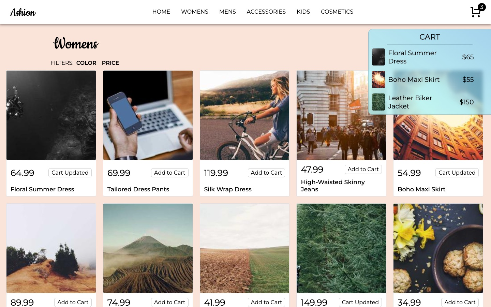
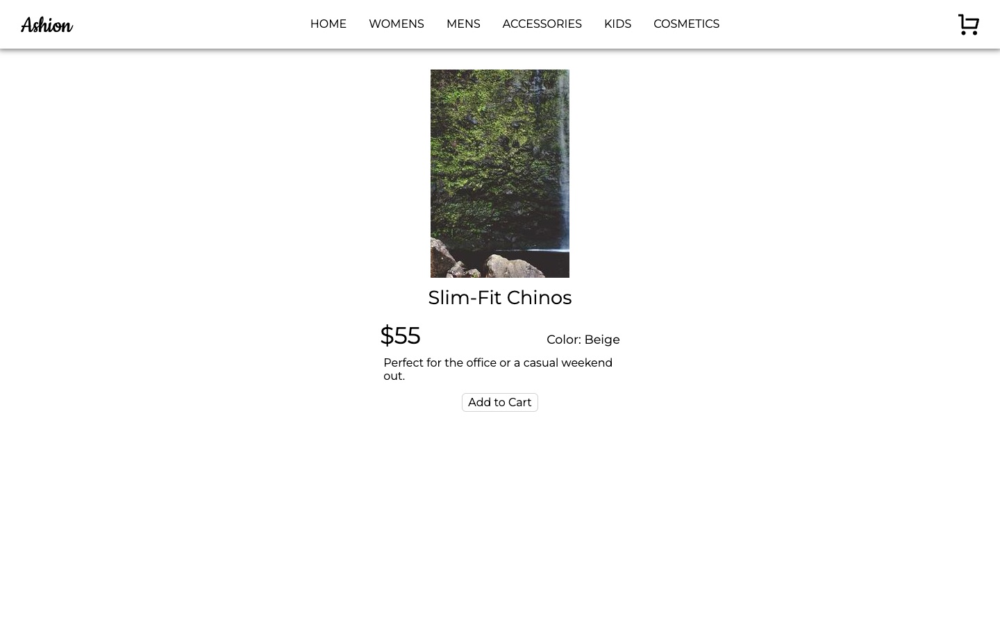

# Ashion

A full-stack fashion store with a React frontend and a REST API backed by SQLite.

**Live demo:** [ashion-lilac.vercel.app](https://ashion-lilac.vercel.app)


## Features

- Home page grid of categories, each showing its live product count
- Category pages listing products from the database
- Product pages with price, colour and description
- A cart you can add to and remove from, with an item count in the header
- Responsive layout with a hamburger menu on mobile



| Product page | Mobile |
|---|---|
|  |  |

Product images are placeholders from [picsum.photos](https://picsum.photos).

## Tech stack

**Frontend** (`ashion/`)
- React 19 with Vite
- React Router
- CSS Modules
- A custom `useApi` hook for fetching and loading state

**Backend** (`ashion_backend/`)
- Hono on Node.js
- SQLite with better-sqlite3 and prepared statements
- A many-to-many relationship between products and categories through a
  `categories_products` join table

**Hosting**
- Vercel: the frontend as a static site, and the Hono app as a serverless function under `/api`

## API

| Method | Endpoint | Returns |
|---|---|---|
| GET | `/api/categories` | All categories |
| GET | `/api/single-category/:id` | One category |
| GET | `/api/category/:id` | Products in a category |
| GET | `/api/category-count/:id` | Number of products in a category |
| GET | `/api/products/:id` | One product |
| POST | `/create-product`, `/remove-product` | Add or remove a product |
| POST | `/create-category`, `/remove-category` | Add or remove a category |

On the live demo the database is read-only, so the POST endpoints only work locally.

## What I learned

- Designing a relational schema with a join table, and querying across it with `JOIN`
- Building a REST API with Hono and prepared statements
- Connecting a React frontend to my own backend, and handling CORS during development
- Structuring a React app with pages, reusable components and a custom hook

## Running locally

Start the backend (port 3456):

```bash
cd ashion_backend
npm install
node index.js
```

In another terminal, start the frontend:

```bash
cd ashion
npm install
npm run dev
```

Then open [localhost:5173](http://localhost:5173).
